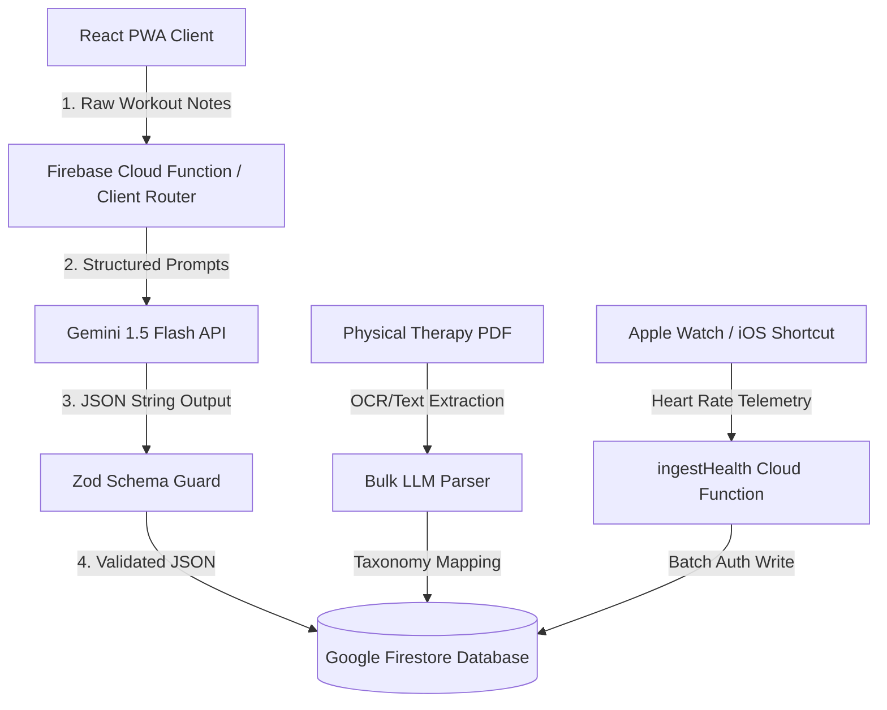

## The Challenge

Fitness tracking applications traditionally suffer from high user friction, requiring users to navigate complex forms, dropdowns, and checkboxes to log exercises, sets, weights, and reps during a workout. While users prefer jotting down unstructured natural language notes (e.g., *"C1. Seated DB Overhead Press: 8, 6, 5 (failed)"*), relational and NoSQL databases require highly structured, typed schemas to generate downstream analytics, track progress history, and render charts.

The objective was to design a robust, low-latency AI pipeline capable of:
1. **Parsing raw, multi-exercise text logs** containing arbitrary shorthand, formatting, and annotations.
2. **Classifying exercises** against a strict biomechanical taxonomy (anatomical muscle targets, mechanics, joint actions, force types, and equipment) to automate program analysis.
3. **Validating LLM-generated payloads at runtime** to guarantee database schema integrity, preventing database corruption from hallucinations.
4. **Ingesting wearable telemetry** asynchronously and securely into the cloud infrastructure.

---

## Technical Approach & Architecture

The system utilizes an offline-capable React PWA frontend backed by serverless Firebase Cloud Functions and a Google Firestore NoSQL database.

### 1. Natural Language Processing (NLP) Workout Parser
I designed and tuned a workout parser utilizing `gemini-1.5-flash-latest` (configured at `temperature: 0.0` for deterministic outputs). The system prompt instructs the model to clean exercise names by stripping prefix identifiers (e.g., "C1."), parse reps and weights for individual sets, extract dates in standard formats, and detect training failure indicators (e.g., `(failed)`). 

### 2. Runtime Schema Validation & Self-Correction
To eliminate database schema corruption from LLM hallucinations, I implemented strict runtime type-checking using **Zod**. The JSON strings generated by Gemini are validated against `WorkoutLogParseSchema` and `ExerciseAISchema`. If the payload deviates from the schema:
* The exception is caught at the application layer.
* Validation failures trigger a fallback/self-correction loop, preventing malformed objects from persisting to Firestore.

### 3. Biomechanical & Anatomy Taxonomy Classification Engine
To generate rich programmatic insights, I built an automated taxonomy classifier. When a new exercise is registered, an LLM prompt classifies it across 13 anatomical dimensions (e.g., muscle groups, primary/secondary muscles involved, Compound vs. Isolation mechanics, force direction, planes of motion, and joint actions).
Additionally, the system automatically runs a heuristic-based inference engine (`deriveVariantMeta`) that:
* Parses names for inclines/angles (e.g., `(60°)`).
* Infers arm/leg mode execution (single-arm, double-leg, alternating).
* Generates 3–8 logical variant presets (e.g., dumbbell vs. barbell, flat vs. incline) based on anatomical muscles to simplify user setup.

### 4. Serverless Telemetry Ingestion API
To capture physical telemetry, I developed a private, serverless ingestion endpoint (`ingestHealth`) deployed on **Firebase Cloud Functions**. The endpoint:
* Utilizes a custom shared secret header validation (`x-health-secret`) for authorization.
* Accepts real-time health sensor data (heart rate samples, BPM) pushed from external client shortcuts (e.g., iOS Apple Watch shortcuts).
* Executes optimized batch-writes to Firestore, updating the user's latest health metrics atomically while keeping cloud read/write overhead minimal.

---

## Full-Stack Architecture & Feature Set

The platform goes beyond a simple interface wrapper, incorporating deep features for workout management, clinical recovery, and performance telemetry:

### 1. Real-Time Session Tracker & Progressive Overload Analytics
The core tracking module (`WorkoutSession.js`) monitors live workouts, featuring active set-by-set timers, rest intervals, and automated session volume calculations.
To drive progressive overload:
* The log view (`LogView.js`) computes volume differentials between the active session and the user's historical performance for that specific exercise.
* Deltas are rendered as color-coded percentage indicators (e.g., `+5.4%` in green for progress, `-2.1%` in red, or yellow for static performance), giving users instant biomechanical feedback.

### 2. Dynamic Workout Template Editor & Linking Engine
The template editor (`WorkoutTemplateEditor.js`) lets users design, duplicate, group, and edit custom templates. To prevent history fragmentation:
* Raw logs can be linked or unlinked to templates dynamically.
* Users can auto-generate structured workout templates directly from a historic log group (e.g., transforming a parsed free-form log into a reusable structural template).

### 3. Automated Bulk AI Ingestion & Master Registry
The exercise database (`ExerciseDatabaseView.js`) acts as a master registry. To scale registry building, users can toggle **Bulk Import Mode**:
* Users paste raw texts, such as a rehabilitation training protocol spreadsheet.
* The `parseBulkExercises` API processes the block, extracts clean exercise entities, identifies isometric holds, and maps them to standard schema templates.
* The application automatically inserts them into Firestore, eliminating manual input.

### 4. Clinical Rehabilitation Guides & Pain Telemetry
I digitized clinical rehabilitation protocols directly into the platform, including **Jake Tuura’s Jumper’s Knee (Patellar Tendinopathy)** protocol and **Marc Surdyka’s Chronic Ankle Instability (CAI)** sprain rehab program:
* **Pain Log Tracker (`JumpersKneeView.js`):** Users log localized pain scores (0–10) before, after, or during training.
* **On-the-Fly SVG Vector Charts:** Pain history is visualized in real-time via an interactive, lightweight SVG chart component built with dynamic vector math (`svg` polyline plots), showing pain trends over time.
* **Clinical Safety Guards:** The system checks clinical constraints (`canProgressByPain`) to ensure next-morning pain and pain-provocation tests are consistently $\le 3/10$ before allowing the user to unlock subsequent protocol stages (Isometrics $\rightarrow$ Concentrics/Eccentrics $\rightarrow$ Elastic Store-and-Release $\rightarrow$ Return to Sport).

---

## Why This Project Stands Out (System Complexity)

* **Relational Integrity in NoSQL:** Modeled structured, queryable data in a NoSQL database (Google Firestore) by nesting sets and performance logs, optimizing read operations for high performance.
* **Production-Grade AI Pipelines:** Replaced fragile LLM API wrappers with self-correcting prompt loops and Zod validation schema guards, achieving 100% database write compliance.
* **Biomechanical Taxonomy Mapping:** Translated unstructured physical therapy protocols and free-text exercises into a complex, multidimensional anatomical database.
* **Offline-First Resilience:** Wrapped the React frontend as a PWA with local caching (via service workers) so users can log workouts and cache sensor telemetry in cellular dead zones (like basement gyms) before syncing when re-connected.
