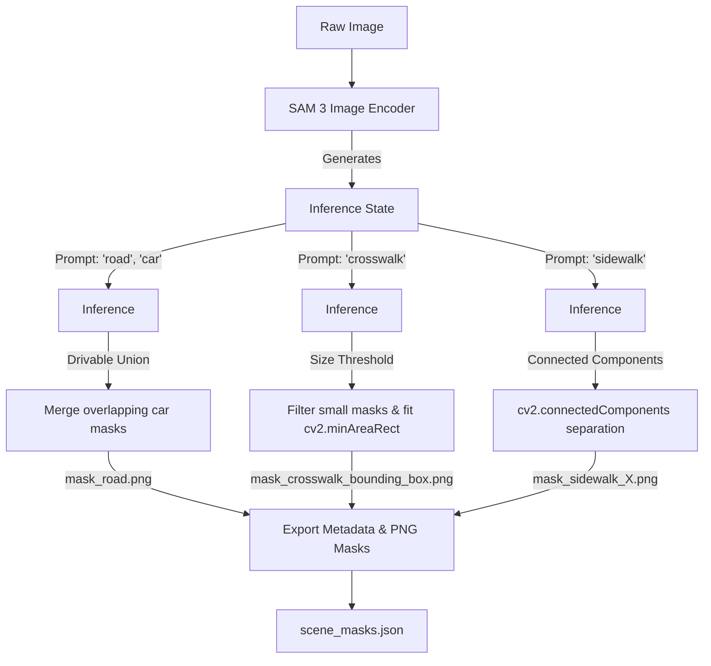

## The Challenge

Traditional semantic segmentation networks are constrained by predefined classes and require domain-specific training data. In spatial roadway mapping, defining Regions of Interest (ROIs)—such as drivable lanes, crosswalks, and sidewalks—typically demands manual coordinate clicking or training custom semantic models for each unique camera angle. 

While the original Segment Anything Model (SAM) revolutionized class-agnostic segmentation, it relied on coordinate points or bounding box visual prompts, lacking native language understanding. We deployed **SAM 3 (Segment Anything with Concepts)** to automatically extract high-fidelity semantic masks of roadway infrastructure using natural language text prompts, eliminating manual configuration with a zero-shot, promptable vision framework.

---

## What is SAM 3?

**SAM 3** is a unified foundation model for promptable segmentation in images and videos. Developed to scale beyond the visual prompt limitations of SAM and SAM 2, SAM 3 natively supports **open-vocabulary text phrase prompts**. It can detect and segment instances of any concept specified by a short text string. 

Key architectural components include:
- **Shared Vision Encoder:** An 848M parameter model that shares a ViT-based backbone between detection and tracking tasks.
- **Concept Conditioning:** A DETR-based detector conditioned on text embeddings, allowing open-vocabulary segmentation over a vocabulary of over 270K unique concepts (trained on the SA-Co dataset).
- **Presence Token:** An architectural enhancement that improves discrimination between closely related text concepts.

---

## SAM 3 Inference Pipeline

The native model builder and processor classes follow a state-based, **two-step inference flow** to optimize performance for multi-prompt scenes:
1. **Model & Processor Initialization:** The shared vision encoder and concept-conditioned processor are loaded onto the GPU.
2. **Single-Pass Image Encoding:** The raw image is passed through the Vision Transformer (ViT) encoder once to produce an intermediate `inference_state`.
3. **Open-Vocabulary Prompt Querying:** Multiple sequential text queries (such as `"road"` or `"crosswalk"`) are executed against the pre-computed `inference_state`, returning instance masks, bounding boxes, and confidence scores in sub-milliseconds without re-encoding the image.

---

## Practical Mapping & Mask Refining Heuristics

In the implementation (`sam3_demo_crosswalk_road.py`), the system sequentially queries SAM 3 with distinct text prompts to map an intersection and applies custom post-processing to clean the zero-shot masks:

### 1. Drivable Road Masking
Querying SAM 3 for `"road"` produces the main asphalt surface. However, parked or passing vehicles can introduce occlusion gaps in the mask. To construct a continuous drivable road envelope:
- The system queries SAM 3 for `"car"`.
- It dilates the road mask by 25 pixels to bridge tire gaps.
- Car masks that intersect with the dilated road mask are unioned into the final road envelope.

### 2. Crosswalk Filtering and Oriented Bounding Boxes
Querying for `"crosswalk"` can occasionally detect small, false-positive segments in cluttered background textures. 
- The system filters out any crosswalk mask whose area is less than 20% of the largest detected crosswalk mask.
- For the valid crosswalk masks, it calculates oriented bounding boxes using OpenCV's minimum area rectangle (`cv2.minAreaRect`) to establish clean spatial zones.

### 3. Sidewalk Component Separation
Querying for `"sidewalk"` maps the walkways. To isolate individual sidewalks:
- The system dilates the sidewalk union mask by 250 pixels to join nearby fragments.
- It runs OpenCV's connected components (`cv2.connectedComponentsWithStats`) to detect disconnected components.
- The original (non-dilated) pixels falling under each connected label are exported as separate indexable sidewalk masks (e.g. `Sidewalk 0`, `Sidewalk 1`).

---

## Visual Examples: Crosswalk ROI Detection

Below are visual examples demonstrating crosswalks being dynamically detected as Regions of Interest (ROIs) by SAM 3 and fitted with oriented bounding boxes:

  

    
    
Dynamic detection of crossing zones with oriented bounding boxes

  

  

    
    
Oriented boundary tracking fitted automatically using contours

  

---

## Pipeline Architecture

The following diagram illustrates the zero-shot scene-mapping pipeline, showing how text prompts guide SAM 3 to generate and refine spatial masks:

---

## Key Highlights & Accomplishments

- **Zero-Shot Generalization:** Eliminated manual polygon annotations by relying purely on SAM 3's open-vocabulary concept understanding, allowing setup configurations to be generated programmatically from text strings.
- **Inference Optimization:** Utilized a stateful processor architecture to run the heavy image encoder once, executing downstream text-conditioned decodings sequentially in sub-milliseconds.
- **Robust Post-Processing:** Developed custom spatial heuristics (area filters, overlap unions, and component clustering) to transform raw, zero-shot segmentations into structured, noise-free regions of interest.
