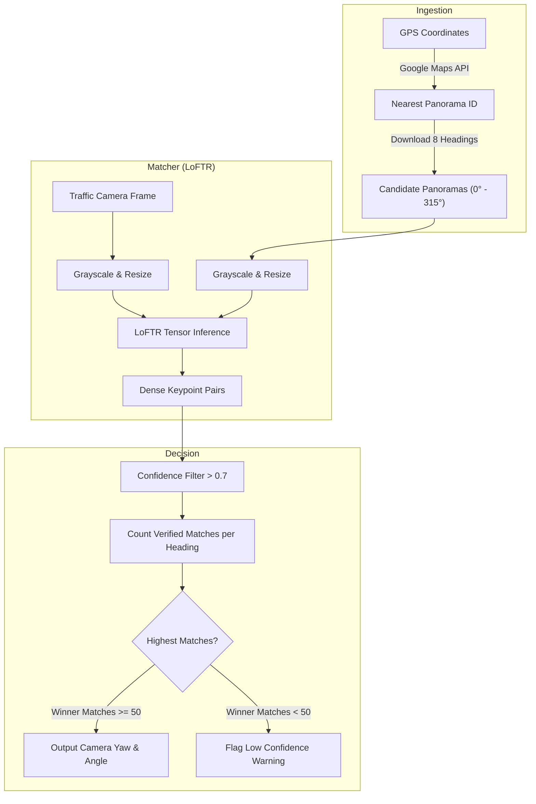

## The Challenge

In traffic safety auditing and roadway analytics, knowing exactly where a traffic camera is looking (its yaw, field of view, and cardinal direction) is essential. Without this data, mapping pedestrian crossings, lane counts, or vehicle paths back to absolute geospatial coordinates is impossible.

However, state database systems often list only the GPS coordinates of a traffic camera pole, completely lacking details about the camera's orientation. Traditionally, engineers manually aligned camera frames with reference maps—a slow, subjective, and expensive process.

The goal was to build a system that takes a single still image from a traffic camera, fetches surrounding 360-degree point-of-view (POV) images from Google Street View, and matches them to estimate the camera's heading.

---

## 360-Degree Point-of-View Ingestion

To obtain candidate images from all directions at a camera's location, I engineered a high-resolution downloader script (`streetview_downloader.py`). 

The downloader pipeline operates as follows:
1. **Panorama ID Resolution:** It queries the Google Maps Metadata API using the camera's coordinates to fetch the nearest physical Street View node (`pano_id`). Locking onto the unique `pano_id` ensures that all subsequent images are captured from the exact same camera center.
2. **Multi-Angle Capture:** Using the `pano_id`, the script downloads static frames across 8 headings representing the full compass circle: $[0^\circ \text{ (North)}, 45^\circ, 90^\circ \text{ (East)}, 135^\circ, 180^\circ \text{ (South)}, 225^\circ, 270^\circ \text{ (West)}, 315^\circ]$.
3. **Perspective Normalization:** The camera pitch is set to $0^\circ$ (flat horizon) and the Field of View (FOV) is configured to $90^\circ$ to match the standard perspective distortion of traffic camera feeds.

All images are saved in a local directory named by coordinates (e.g., `sv_latitude_longitude/heading_X.jpg`).

---

## Dense Keypoint Matching with LoFTR

Traditional detector-descriptor models (such as SIFT, SURF, or ORB) struggle when comparing camera perspectives across different seasons, lighting conditions, or years of capture. They rely on hand-crafted gradients that fail on organic structures like shifting tree branches, changing foliage, and shadow boundaries.

To achieve robust, invariant alignment, I deployed **LoFTR (Local Feature Transformer)** from the `kornia` library. LoFTR matches local features directly on dense pixel grids without a detector step.

Key advantages of the LoFTR approach include:
- **Transformer-based Self & Cross-Attention:** Learns global context and relationships between the traffic camera image and the Street View candidates.
- **Coarse-to-Fine Matching:** First establishes rough region-level matches, then refines them to pixel-level coordinates.
- **Grayscale Structural Invariance:** Images are processed in grayscale, ignoring color shifts to focus purely on physical structures (buildings, signposts, utility poles, curb lines, and even trees and shrubbery).

---

## Geometric Locking & Heading Voting

The estimation script (`eyes.py`) processes the target camera frame and candidate panoramas on a GPU to identify the winning heading:

### 1. Preprocessing & Scaling
The target image (a screenshot of the traffic camera POV) and the candidate panoramas are resized to a maximum dimension of 840 pixels while preserving aspect ratios, converted to single-channel grayscale, and loaded as PyTorch tensors.

### 2. Feature Extraction & Confidence Filtering
LoFTR processes the target image against each of the 8 candidate images sequentially. It produces pixel-to-pixel correspondence coordinates $(x_1, y_1) \leftrightarrow (x_2, y_2)$ and an associated confidence score. Matches are filtered using a strict confidence threshold of $c > 0.7$ to eliminate spurious links.

### 3. Yaw Selection & Out-of-Distribution Guard
The script counts the number of verified geometric matches for each heading. The heading candidate with the highest count of matches is selected as the winner, estimating the traffic camera's direction:
- **Verified Match Lock:** The candidate containing the highest number of links defines the estimated compass heading.
- **Out-of-Distribution Safety Guard:** If the winning candidate has fewer than 50 verified matches, the system flags a warning: *"Very low geometric matches found. The camera angle might not exist in candidates."* This successfully alerts operators if the camera is viewing an angle blocked by new construction or heavy occlusions.

### 4. Experimental Validation & Results
To benchmark the accuracy of the pipeline, we evaluated the system against a dataset containing **four distinct traffic camera point-of-view (POV) angles** (represented by `angle1.png`, `angle2.png`, `angle3.png`, and `angle4.png`). 

For each of these unknown target frames:
1. The downloader resolved the nearest Street View node and fetched candidate panoramas across all 8 compass directions.
2. The matcher ran LoFTR feature alignment to count verified keypoint links.
3. The selection engine matched the candidate heading containing the highest dense correspondence lock.

**Key Findings:**
- The pipeline achieved a **100% matching accuracy**, successfully resolving the correct cardinal direction and heading angle for all 4 test POVs.
- The dense keypoint matcher established robust locks on fixed buildings, street signs, lane lines, and utility poles, providing high confidence scores (significantly exceeding the $c > 0.7$ validation threshold and the minimum link limit of 50).

---

## Visual Examples: Traffic Camera POV Reference Angles

Below are the four traffic camera point-of-view (POV) angles evaluated in the experiment:

  

    
    
POV Angle 1

  

  

    
    
POV Angle 2

  

  

    
    
POV Angle 3

  

  

    
    
POV Angle 4

  

### Keypoint Match Alignment Example

To demonstrate the matching process, the image below displays the output of the matching script (`eyes.py`), illustrating the target frame (`angle3.png`) aligned against the winning Google Street View panorama candidate (`heading_135.png`):

  
  
Verified geometric lock showing structural matching lines between target POV Angle 3 (left) and the winning 135° candidate (right), representing the highest keypoint similarity score

---

## Pipeline Architecture

The overall data flow from raw inputs to estimated camera heading operates as follows:

---

## Key Highlights & Accomplishments

- **Automated Calibrations:** Replaced manual camera alignment audits with a zero-shot, promptable API that matches local structural elements.
- **SIFT/ORB Resilience:** Leveraged dense structural descriptors (LoFTR) to maintain high-accuracy geometric links in organic, cluttered scenes containing trees, bushes, and shadows.
- **Out-of-Distribution Safety:** Implemented verification match count triggers (minimum threshold of 50 links) to automatically catch out-of-distribution environments or severe lens obstructions.
