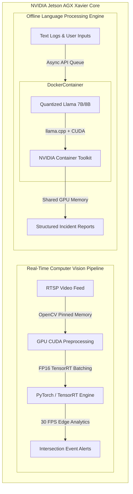

## Project Overview

In state infrastructure and traffic management environments, edge nodes must operate under strict power budgets, high reliability requirements, and often zero cloud connectivity. Streaming raw HD video or text logs back to central cloud servers incurs significant bandwidth costs, latency delays, and compliance issues.

To solve this, I engineered a unified, GPU-accelerated **Edge AI & Perception Stack** deployed directly on **NVIDIA Jetson AGX Xavier** modules. This solution combines two critical edge intelligence capabilities:
1. **Real-Time Computer Vision Pipeline:** Accelerated intersection object detection and tracking from 5 FPS to a stable **30 FPS**, reducing detection latency by 85%.
2. **Containerized Offline LLM Inference:** Deployed quantized 7B/8B parameter **Llama models** in Docker containers using CUDA acceleration for 100% offline text parsing and incident logging.

---

## Architecture & System Design

---

## Key Technical Components

### 1. Real-Time Vision Optimization (CPU to GPU Migration)
- **CUDA Frame Preprocessing:** Re-engineered raw RTSP video frame decoding and image normalization to run directly on CUDA tensors in GPU memory, bypassing costly CPU-to-GPU memory copies.
- **FP16 Mixed Precision:** Optimized object detection and multi-object tracking backbones using **NVIDIA TensorRT**, quantizing models to FP16 to maximize Tensor Core utilization without sacrificing accuracy.
- **Async Threaded Pipeline:** Designed multi-threaded frame readers buffering frames into pinned memory, increasing GPU core utilization beyond 90%.

### 2. Containerized Offline LLM Inference
- **NVIDIA Container Toolkit on ARM64:** Built customized Docker deployment images bundling specific Jetpack CUDA drivers, C++ backends, and Python APIs into a single-command reproducible container.
- **Quantized Llama Model Loading:** Utilized GGUF/GPTQ quantization formats to fit 7B/8B parameter Llama models into shared Jetson memory under 6GB, leaving sufficient headroom for simultaneous computer vision processes.
- **Non-Blocking Inference Queue:** Implemented an asynchronous queue streaming generated tokens without blocking the main event-handling threads.

---

## Technical Impact & Capabilities

- **Real-Time Edge Speeds:** Accelerated computer vision inference from 5 FPS to **30 FPS**, cutting end-to-end detection latency by **85%**.
- **100% Offline LLM Processing:** Enabled secure, zero-cloud-dependency incident parsing and structured report generation on remote edge nodes.
- **Resource Optimization:** Maintained a compact memory profile under 6GB, allowing simultaneous vision and language inference on shared hardware memory.
- **Reproducible Container Blueprints:** Containerized complex Jetpack and CUDA dependencies into portable Docker blueprints deployable across remote state infrastructure.
