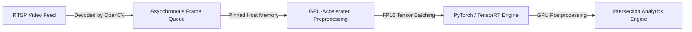

## The Challenge

Traffic management centers monitor intersections to detect near-miss collisions, pedestrian violations, and vehicle flow rates. However, traditional setups require streaming high-definition video back to central servers, incurring high bandwidth costs and latency.

The initial local prototype at the University of Texas processed video streams on-site using CPU-bound models, yielding a sluggish **5 FPS**. This was insufficient for real-time monitoring and event detection. The goal was to build an edge perception stack capable of processing high-resolution feeds at **real-time speeds (~30 FPS)** on a low-power, edge-hardware budget.

---

## Technical Approach & Architecture

Due to proprietary limitations, the source code is private. The structural design of the pipeline is detailed below:

### 1. GPU-Accelerated Preprocessing
The primary bottleneck in the initial prototype was resizing, normalizing, and converting video frames on the CPU. I rewrote the preprocessing pipeline to utilize **CUDA-enabled tensors** directly, keeping decoded frames in GPU memory and bypassing CPU-to-GPU bottleneck transfers.

### 2. FP16 Quantization & Optimization
I optimized the deep learning model architectures (specifically targeting object detection and tracking backbones) for deployment using **NVIDIA TensorRT**. By quantizing models to FP16 mixed precision, we maximized throughput on the Jetson edge hardware's Tensor Cores without losing detection accuracy.

### 3. Pipeline Multithreading & Batching
I implemented a multi-threaded RTSP frame reader that decodes video frames in a separate thread and buffers them into pinned memory. We grouped frames into overlapping batches to keep the GPU core utilization above 90%.

---

## Impact and Key Accomplishments

- **Real-Time Edge Speeds:** Accelerated inference from 5 FPS to a stable **30 FPS** on NVIDIA Jetson edge devices.
- **Latency Reduction:** Reduced end-to-end detection latency by **85%**, unlocking the capability for immediate event alerts.
- **Robust Edge Reliability:** Designed automatic connection-recovery mechanisms to maintain continuous service over cellular RTSP streams.
- **State Deployment:** The optimized stack has been deployed in-field for active intersection analysis, demonstrating the viability of low-cost edge nodes for state agencies.
