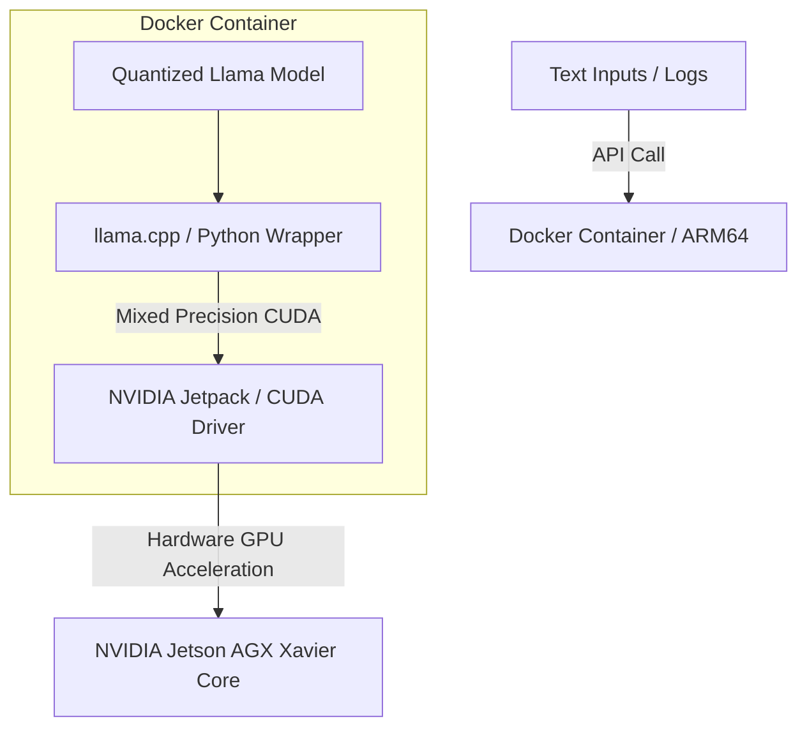

## The Challenge

Large Language Models (LLMs) are highly capable of understanding unstructured data, but they typically require massive cloud data centers or public API access. In state infrastructure projects—such as remote highway monitoring stations or emergency response units—internet connectivity is either unreliable, expensive, or completely unavailable due to security compliance.

To utilize LLMs for real-time text analysis and warning alerts, the solution had to run **entirely offline** on resource-constrained **NVIDIA Jetson AGX Xavier** edge hardware. The primary challenges were:
1. Setting up hardware-accelerated CUDA and driver bindings on a low-power ARM64 device.
2. Managing the heavy memory footprint of LLMs on a device with shared system/GPU memory.
3. Ensuring the deployment process was simple and reproducible.

---

## Technical Approach & Architecture

Because this system is deployed within restricted environments, the source code is confidential. Below is the system design and orchestration:

### 1. Containerized CUDA Environment
Configuring CUDA libraries and deep learning frameworks on ARM64 architectures is notoriously error-prone. I resolved this by building a customized **Docker image** using the **NVIDIA Container Toolkit**. This container bundled specific versions of PyTorch, CUDA Toolkit, and Jetpack libraries compatible with the Jetson Xavier hardware, creating a single-command deployable runtime.

### 2. Quantized Model Inference
To run a 7B or 8B parameter model on the Jetson AGX Xavier (which shares 32GB of RAM between the CPU and GPU), I utilized advanced quantization formats (GGUF/GPTQ) via a optimized C++ inference backend. By loading quantized models, we kept memory consumption under 6GB, leaving ample headspace for OS operations and other edge software.

### 3. Asynchronous Inference Queue
To prevent the main thread from blocking during text generation, I designed an asynchronous inference queue in Python. The system processes input text, sends it to the GPU, and streams tokens back via an API endpoint, allowing local user interfaces to display results fluidly.

---

## Impact and Key Accomplishments

- **100% Offline Capability:** Enabled LLM-driven incident parsing and logging without requiring external cloud networks or API keys.
- **Reproducible Environments:** Reduced environment configuration time from days to minutes by containerizing the complex Jetpack/CUDA dependencies.
- **Resource Optimization:** Maintained a compact memory profile, fitting the LLM stack comfortably alongside active computer vision pipelines on the same device.
- **Scalability:** Built a portable, containerized blueprint now ready to be deployed across multiple remote sites with different Jetson architectures.
