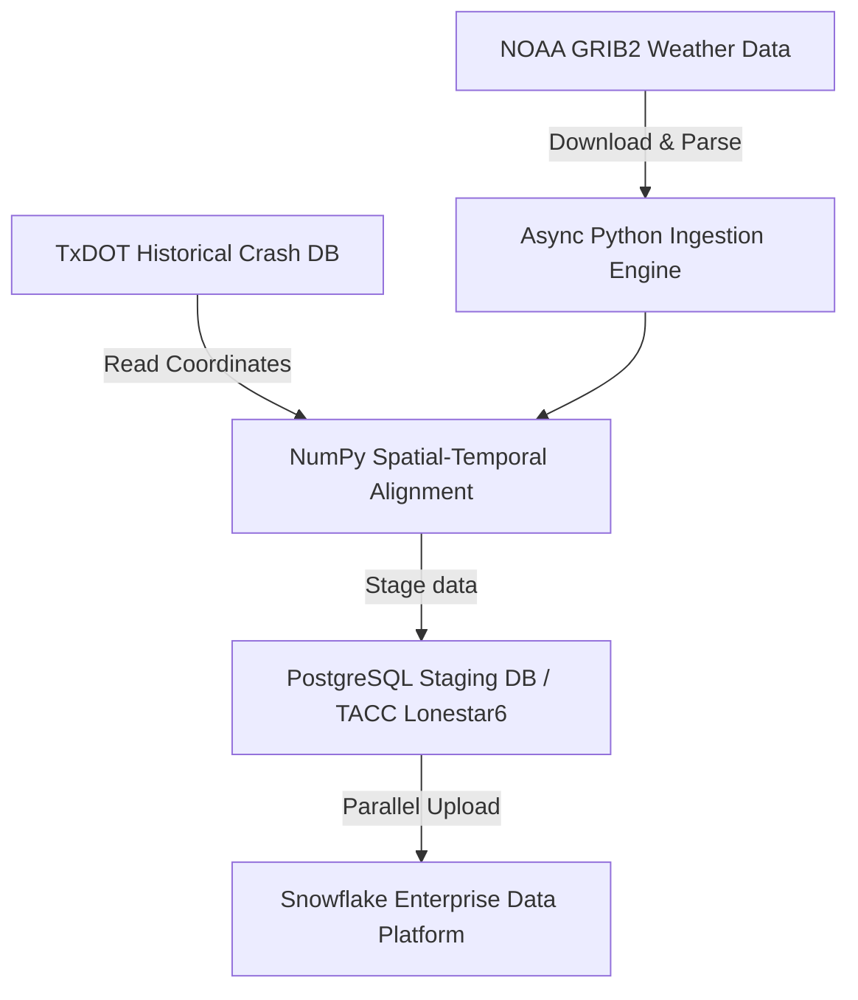
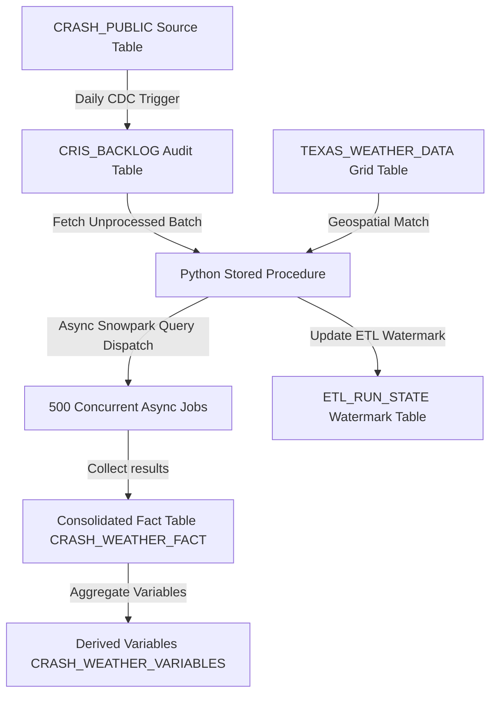

## The Challenge

Weather substantially affects traffic operations, roadway safety, design, and overall transportation system performance. Traditional methods rely on physical weather stations, which suffer from limited coverage, and subjective officer reporting, which creates data inconsistencies.

Integrating high-resolution gridded weather datasets (such as NOAA's Multi-Radar Multi-Sensor [MRMS] and NEXRAD) resolves these issues by combining multiple sensors into a fine-grained, statewide grid. However, managing this gridded weather data creates massive I/O and CPU bottlenecks. 

Additionally, the existing data pipeline utilized heavily quantized weather formats (**NetCDF**) which suffered from a **4.5% under-reporting bias** in regional rainfall detection. The system needed:
1. High-precision NOAA GRIB2 floating-point data parsing.
2. A high-throughput alignment mechanism capable of processing millions of records.
3. Integration with TxDOT's first-ever direct ingestion pipeline into their Snowflake Enterprise Data Platform (EDP).

---

## Project Publications & Strategy Reports

This project was developed at the University of Texas at Austin's Center for Transportation Research (CTR). The research, methodology, and computational performance of the pipeline were compiled into a peer-reviewed research paper and presented as a poster at the **Transportation Research Board (TRB) Annual Meeting**. 

To guide the cloud transition and justify key infrastructure choices to TxDOT decision-makers, I authored a comprehensive strategic architectural analysis report comparing deployment models on AWS and Snowflake.

  <a href="{{ '/assets/docs/TRB_Paper.pdf' | relative_url }}" class="btn-secondary" target="_blank">
    <i class="fa-solid fa-file-pdf" style="color: #ef4444;"></i> Download TRB Research Paper (PDF)
  </a>
  <a href="{{ '/assets/docs/TRB_Poster.pptx' | relative_url }}" class="btn-secondary">
    <i class="fa-solid fa-file-powerpoint" style="color: #eab308;"></i> Download Poster Presentation (PPTX)
  </a>
  <a href="{{ '/assets/docs/GRIB2_Pipeline_EC2_vs_Snowflake.pdf' | relative_url }}" class="btn-secondary" target="_blank">
    <i class="fa-solid fa-file-pdf" style="color: #00f2fe;"></i> Download Architecture Report (PDF)
  </a>
  <a href="https://github.com/Adam-Kosicki/mrms-precipitation-analysis/blob/main/s3_grib2/TxDOT_GRIB2_Code_Documentation.md" target="_blank" rel="noopener noreferrer" class="btn-secondary">
    <i class="fa-solid fa-code" style="color: var(--accent-cyan);"></i> View Technical Code Docs
  </a>

---

## Project Timeline & Milestones

This project successfully transitioned from a research-driven pilot to a statewide, fully funded enterprise-level ingestion pipeline. The timeline below highlights the critical milestones of this transition in April 2025:

  

    
April 18, 2025

    

      <strong>Ingestion Strategy Document Published</strong> 
      Published the initial ingestion strategy report (<code>CTR-TxDOT_CRIS-MRMS_Ingestion_Strategy_v1.0</code>), defining proposed ingestion pathways for the CRIS-MRMS weather-enhanced crash dataset.
    

  

  

    
April 24, 2025

    

      <strong>Cross-University Collaboration Kickoff</strong> 
      Initiated collaborative kickoff meetings between the UT Austin Center for Transportation Research (CTR) and the Texas A&M Transportation Institute (TTI) data maturity and ingestion teams to translate requirements between the research data stack and the ITD infrastructure.
    

  

  

    
April 28, 2025

    

      <strong>Designated as Technical Lead</strong> 
      CTR Leadership officially appointed Adam Kosicki as the <strong>Technical Lead</strong> for the weather-to-CRIS/EDP pipeline.
    

  

  

    
April 28, 2025

    

      <strong>Enterprise-Wide Approval & ITD Funding</strong> 
      TxDOT's Information Technology Division (ITD) formally assessed the project under request ID <code>DMND0003521</code>. ITD classified the solution as a statewide, <strong>"enterprise-wide solution"</strong> and approved full ITD funding, noting that it assists all districts state-wide in roadway safety analysis.
    

  

  

    
April 29, 2025

    

      <strong>EDP Credentialing & Development Launch</strong> 
      Finalized Acceptable Use compliance and received official development credentials for TxDOT's Snowflake Enterprise Data Platform (EDP), initiating active development.
    

  

---

## NetCDF to GRIB2 Architectural Strategy

Transitioning from quantized NetCDF files to floating-point GRIB2 weather grids restored precision but introduced severe software dependency challenges. Decoding GRIB2 records requires specialized, low-level libraries: the `pygrib` Python library (reliant on the compiled `eccodes` C library from ECMWF) and the `wgrib2` command-line utility (compiled from source with `gcc`, `gfortran`, and libraries for NetCDF, PNG, and Jasper/OpenJPEG).

To address this dependency hurdle, I presented an architectural trade-off analysis comparing three deployment options:

  <table class="comparison-table">
    <thead>
      <tr>
        <th>Criterion</th>
        <th>Option 1: Incumbent EC2-Centric</th>
        <th>Option 2: "Fully Native" Snowflake</th>
        <th>Option 3: Hybrid Orchestrated Compute (Selected)</th>
      </tr>
    </thead>
    <tbody>
      <tr>
        <td><strong>Technical Feasibility</strong></td>
        <td>Guaranteed (Full OS control)</td>
        <td><strong>Infeasible</strong> (Blocked by sandbox)</td>
        <td>Guaranteed (Containerized)</td>
      </tr>
      <tr>
        <td><strong>Dependency Handling</strong></td>
        <td>Manual OS installation & compilation</td>
        <td>Cannot load compiled C/Fortran libraries</td>
        <td>Docker images pre-build all C/Fortran libraries</td>
      </tr>
      <tr>
        <td><strong>Infrastructure Overhead</strong></td>
        <td>High (OS patching, security updates)</td>
        <td>None</td>
        <td>Low (Serverless compute, managed Airflow)</td>
      </tr>
      <tr>
        <td><strong>Compute Cost Model</strong></td>
        <td>Fixed (Always-on instance-hours)</td>
        <td>Consumption-Based</td>
        <td>Ephemeral (Fargate container run duration)</td>
      </tr>
      <tr>
        <td><strong>Long-term Maintainability</strong></td>
        <td>Low (Manual scaling & configuration drift)</td>
        <td>N/A</td>
        <td>High (Declarative infrastructure-as-code)</td>
      </tr>
      <tr>
        <td><strong>Recommended Selection</strong></td>
        <td>Legacy IaaS (High operational drag)</td>
        <td>Rejected (Technical constraints)</td>
        <td><strong>Chosen Architecture</strong> (Lowest TCO, high agility)</td>
      </tr>
    </tbody>
  </table>

### Why Native Snowflake (Snowpark UDFs) Failed
Although Snowflake's Snowpark allows executing Python code natively, its secure, sandboxed runtime environment fundamentally blocks compiled C/Fortran binaries. Attempting to install the `eccodes` C library through the Anaconda Channel or staging custom libraries failed due to restricted access to underlying system libraries. Additionally, executing external CLI tools like `wgrib2` was impossible since Snowpark UDFs cannot call subprocess commands.

### The Hybrid Cloud Solution
To bypass these limitations, we designed a **Hybrid Orchestrated Compute Architecture**:
1. **Amazon MWAA (Managed Apache Airflow)** acts as the orchestrator, detecting raw GRIB2 files arriving in AWS S3.
2. Airflow spins up ephemeral **AWS Fargate** containers pre-packaged with a Docker image containing compiled `eccodes`, `wgrib2`, and Python libraries.
3. The containers decode GRIB2 files to structured Apache Parquet format and write them back to S3.
4. Airflow executes a `COPY INTO` command, bulk-loading the structured data into Snowflake, where it is made available for statewide querying.

---

## System Architecture

The overall system data flow operates as follows:

### 1. Asynchronous Ingestion Pipeline
To eliminate network latency when fetching thousands of binary GRIB2 files from NOAA, I engineered an asynchronous Python pipeline using `asyncio` and `aiobotocore`. The pipeline manages concurrent connections to the public `noaa-mrms-pds` S3 bucket, overlapping network requests and streaming compressed GRIB2 binary files (`.grib2.gz` files, averaging 0.56 MB) directly into high-speed memory buffers. A custom linear backoff retry strategy was implemented to robustly handle transient network interruptions or S3 API throttling.

### 2. Parallel Processing & Decoding
GRIB2 decoding is CPU-heavy. We bypassed Python's Global Interpreter Lock (GIL) and maximized hardware utilization on high-performance compute nodes by distributing parsing workloads across multicore processors using Python's `multiprocessing` library. Each worker process is responsible for decompressing files, reading the grid variables (such as the 2D array of radar precipitation rate values in the 7000x3500 `PrecipRate` product), and converting the raw rate (mm/hr) into a 2-minute accumulation depth using the standard formula:
$$\text{Accumulation (mm)} = \frac{\text{PrecipRate (mm/hr)}}{60} \times 2$$

### 3. Vectorized Spatial-Temporal Alignment
To map crash coordinates to weather grid points, standard nested loops would have taken months to execute. I resolved this bottleneck by engineering a vectorized nearest-neighbor alignment algorithm using **NumPy binary search** (`numpy.searchsorted`). By performing simultaneous binary searches on the sorted grid boundaries, we reduced the coordinate lookup complexity to $O(M \log N)$ (where $M$ is the incident batch size and $N$ is the grid dimensions), matching millions of coordinates in seconds.

To avoid database I/O bottlenecks during writes, the pipeline staging layer uses a PostgreSQL bulk `copy_records_to_table` and transactional `UPDATE ... FROM` strategy. Rather than executing thousands of separate database updates, results are loaded into a temporary staging table in a single transaction and merged into the target fact table, preventing index lock contention.

---

## Production Ingestion: Snowflake Stored Procedure & Tasks

Following the successful proof-of-concept, the platform transitioned into a **native, production-grade ingestion workflow** inside TxDOT's Snowflake Enterprise Data Platform (EDP). In this deployment phase (`snowflake_dev`), the weather data is pre-loaded into a tabular grid table (`TEXAS_WEATHER_DATA`), allowing us to bypass C-library dependency constraints and perform spatial-temporal lookups entirely within Snowflake.

### 1. Snowflake Task Orchestration
The ingestion workflow is orchestrated by a native **Snowflake Task** configured to execute on a daily schedule, firing immediately after the upstream CRIS database completes its daily refresh at ~06:15 Central Time. 

### 2. Incremental Sync and Backlog Management
To ensure high reliability and idempotence:
- **ETL Watermark**: An `ETL_RUN_STATE` table stores a high-water mark timestamp (`CRIS_WM`). Each execution reads the watermark to capture newly created or modified records in the source tables.
- **Audit Backlog**: A dedicated `CRIS_BACKLOG` table tracks pending incidents. Records that fail to match due to missing meteorological files are retried up to a maximum limit (`MAX_BACKLOG_ATTEMPTS = 5`) before being enqueued for manual auditing, protecting the pipeline from infinite-loop failures.

### 3. Dynamic Timezone Handling & Bounding Box Pruning
- **County-Level Timezone Conversions**: Texas spans multiple time zones. The system dynamically queries county identifiers (`CNTY_ID`) to determine local time zones (e.g., mapping El Paso and Hudspeth counties to Mountain Time `America/Denver`, and other counties to Central Time `America/Chicago`) to align crash timestamps with UTC-normalized MRMS records.
- **Bounding Box Pruning**: To optimize spatial lookup speeds, the query bounds candidate grid points to a search radius of $0.015^\circ$ (~1.6 km) around each crash coordinate. This restricts candidate points before executing exact distance computations, saving substantial warehouse credits.

### 4. Asynchronous Snowpark Execution
The daily ingest runs inside a Python 3.11 Snowpark Stored Procedure. To handle high volume:
- **Batch Processing**: Incidents are grouped into batches of 500.
- **Async Queries**: The stored procedure compiles a single SQL query per incident that extracts weather metrics over a 60-minute lookback window (30 distinct 2-minute steps). These queries are dispatched asynchronously via Snowpark's `collect_nowait()` method.
- **Geospatial Join**: The SQL query computes exact geodesic distances using Snowflake's native `ST_DISTANCE` and `ST_MAKEPOINT` functions, selecting the nearest grid point using a `QUALIFY ROW_NUMBER() OVER (PARTITION BY time ORDER BY distance) = 1` clause.
- **Bulk Merge**: Results are gathered asynchronously using `job.result()` and merged in bulk into the production tables (`CRASH_WEATHER_FACT` and `CRASH_WEATHER_VARIABLES`), completing hundreds of spatial-temporal lookups in parallel.

---

## Quality Assurance & Pipeline Validation Framework

To ensure that the weather-to-crash matching pipeline delivers enterprise-grade reliability and scientific correctness, we designed a rigorous, multi-tiered Quality Assurance/Quality Control (QA/QC) and testing framework. This framework guarantees data integrity across the entire ETL lifecycle—from ingestion, through spatial-temporal alignment, to final production stored procedures.

### 1. Database-Native Schema & Observability Architecture
The database design incorporates dedicated staging, monitoring, and audit tables that provide end-to-end data lineage and observability:
- **`CRASH_WEATHER_VARIABLES`**: The primary results table (one row per crash) containing final derived weather variables, data quality flags, and metadata.
- **`CRASH_WEATHER_FACT`**: A granular evidence table storing 2-minute MRMS weather data points linked to each crash (30 records per crash in the 60-minute lookback window), supporting manual recomputation and verification.
- **`CRASH_PROCESS_HISTORY`**: An audit trail that logs every reprocessing event triggered by location or time updates in the source CRIS table.
- **`PROCESSING_RUNS`**: A batch-level execution log capturing started/finished times, configurations, watermarks, compute warehouse statistics, and volume of succeeded vs. failed records.
- **`PROCESSING_ERRORS`**: A standardized log recording crashes that failed to process along with descriptive error codes and messages.
- **`CRIS_BACKLOG`**: An operational queue tracking pending or retrying crash records. Incidents are limited to `MAX_BACKLOG_ATTEMPTS = 5` to prevent infinite retrying of records with missing weather files.

### 2. Double-Blind Scientific Validation (Snowflake vs. NOAA `wgrib2` CLI)
Because the pipeline emulates raw GRIB2 coordinate extraction natively inside Snowflake using geospatial SQL, it was critical to prove the database logic matched physical reality:
- **The Validation Methodology**: We designed an offline validation workflow that downloaded raw binary `.grib2.gz` files directly from the authoritative NOAA MRMS S3 archive (`noaa-mrms-pds`) for a subset of crash coordinates and time windows.
- **Double-Blind Execution**: We ran NCEP's compiled C-binary `wgrib2` command-line tool locally on these raw files using a custom Python harness (`compute_wet_counts_wgrib2.py`) to query coordinates and extract raw precipitation rates (mm/hr).
- **Result Equivalence**: Comparing the local `wgrib2` outputs against the Snowflake-native `CRASH_WEATHER_FACT` table confirmed perfect parity:
  - **Spatial Accuracy**: Geodesic distances computed using Snowflake's `ST_DISTANCE` matched Haversine calculations (e.g., matching a spatial offset of **296.24 meters** to the nearest grid cell center for Crash ID `21158255` within floating-point precision).
  - **Fidelity Parity**: Extracted raw precipitation rates and derived variables (such as cumulative rainfall depth and minutes since rain started) matched the binary grid headers exactly.

> [!TIP]
> **Scientific Verification**: Performing offline double-blind validation checks against compiled binaries (like `wgrib2`) is a highly effective way to verify the correctness of cloud-native geospatial engines (such as Snowpark/SQL) when handling complex, non-standard scientific datasets.

### 3. Staged Integration & Regression Test Suite
During production baseline evaluation (evaluating 34,026 crash records over a three-week baseline from March 24 to April 11, 2026), the pipeline was verified against nine automated test cases:

| Test Case ID | Category | Objective | Key Findings & Baseline Metrics |
| :--- | :--- | :--- | :--- |
| **TC-A1** | Coverage & Completeness | Verify daily processed volume and temporal coverage consistency between runs and results tables. | Successfully processed **34,026 crashes** (averaging **2,268 daily**). Audited processing state shifts to ensure updated records are correctly re-attributed. |
| **TC-A2** | Coverage & Completeness | Enforce reprocessing trigger policy (only recompute if coordinate change > 1,000 ft or timestamp shifts). | Confirmed zero unnecessary record churn (fewer than **1%** of daily processed crashes triggered reprocessing). |
| **TC-B1** | Join Integrity | Validate nearest-time lookback matching and dynamic, county-level timezone routing prior to UTC conversion. | El Paso and Hudspeth counties correctly routed to `America/Denver` (Mountain Time); all other counties routed to `America/Chicago` (Central Time). Mean nearest-time lag of **0.46 minutes**. |
| **TC-B2** | Join Integrity | Confirm spatial nearest-grid cell matching and capture coordinate overwrite anomalies. | Mean spatial offset between crash coordinate and grid point was **399.2 meters** (aligning with MRMS cell resolution). Successfully caught and handled edge-case source updates. |
| **TC-C1** | Output Quality | Cross-validate MRMS-derived `RAIN_STATUS` against manual officer-reported weather conditions in CRIS. | Established baseline mismatch metrics: **1.1%** type A mismatch (officer reported rain, radar showed dry) and **0.7%** type B mismatch (radar showed rain, officer reported dry). |
| **TC-D1** | Operational Health | Track pipeline run reliability, failure rates, and data completeness quality tiers. | Achieved an operational run success rate of **>99.7%** (failures due to missing NOAA files kept below **0.3%**). Flagged minor completeness gaps (e.g., missing 1 out of 30 frames). |
| **TC-D2** | Operational Health | Establish runtime performance benchmarks and scalability trends. | Average daily runtime of **56.3 minutes** with a stable processing throughput of **2,418 crashes per hour** scaling linearly with volume. |
| **TC-E1** | Data Freshness | Measure CRIS ingestion latency (time from crash occurrence to data warehouse availability). | Proved **87% to 90%** of crash records are processed and matched on the same day they are ingested into the data warehouse. |
| **TC-E2** | Data Freshness | Quantify NOAA MRMS GRIB2 availability lag relative to pipeline execution start time. | Average weather data recency lag was **2 to 3 days**, demonstrating that overall pipeline latency is bounded by the CRIS crash reporting cycle rather than weather data availability. |

---

## Meteorological Data Processing Efficiencies

The primary contribution of this work was demonstrating that a statewide grid-to-roadway mapping pipeline could run sustainably on standard hardware.

- **Throughput:** The system processes and correlates **>20,000 records per minute**, enabling validation of weather-related safety data across years of Texas history.
- **Precision Restoration:** By transitioning from quantized NetCDF files to full floating-point NOAA GRIB2 files, we eliminated a **4.5% under-reporting bias** in regional rainfall detection.
- **Supercomputing Scale:** Successfully compiled years of historic weather grids in **under 48 hours** by deploying the pipeline onto the **Texas Advanced Computing Center (TACC) Lonestar6** supercomputing cluster.

---

## Impact and Key Accomplishments

- **Successful Cloud Migration:** Established the blueprint and spearheaded TxDOT's first direct data integration into their Snowflake EDP.
- **Improved Data Accuracy:** Restored precision in state-level safety correlation analyses.
- **Enterprise-Wide Adoption:** The successful pilot prototype unlocked IT-division funding (Request ID `DMND0003521`) and was adopted as a statewide solution, enabling all TxDOT districts to perform weather-enhanced crash analytics.
- **Technical Leadership:** Served as the Technical Lead directing the end-to-end design, university collaboration, and technical handover.
