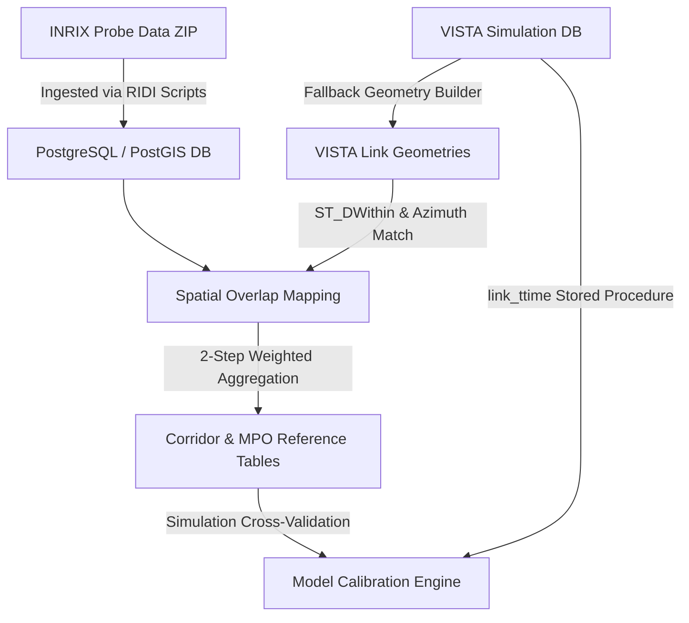

## The Challenge

In large-scale transportation modeling, Dynamic Traffic Assignment (DTA) simulations (like VISTA) are critical for predicting how traffic patterns evolve under various scenarios, such as construction, incidents, or transit adjustments. However, these predictive simulations must be calibrated against real-world measurements to ensure their accuracy before state agencies can rely on them for infrastructure planning.

Comparing simulated results to observed data introduces substantial engineering and mathematical challenges:
1. **Network Mismatch:** Simulation networks use simplified segment links, while real-world data providers (like INRIX) map traffic to proprietary segment geometries.
2. **Spatial-Temporal Scale:** Roadways overlap partially, requiring spatial joins that account for segment lengths and directionality across thousands of links.
3. **Data Volume:** Processing millions of time-series probe vehicle records down to 15-minute aggregation bins generates heavy database I/O and memory bottlenecks.

The goal was to design an end-to-end validation pipeline that dynamically maps, aggregates, and compares VISTA simulation outputs with real-world INRIX travel times.

---

## Dynamic Traffic Assignment (DTA) & Traffic Prediction

To build systems tailored to large-scale transportation challenges, it is essential to understand the distinction between static traffic planning and predictive simulations. 

### What is DTA?
**Dynamic Traffic Assignment (DTA)** is a traffic modeling methodology that simulates time-varying traffic flows and routing decisions. Unlike static models that assume uniform traffic conditions across an entire day, DTA models:
- **Congestion Propagation:** How bottlenecks form, grow, and dissipate over time (e.g., modeling queue spillbacks and shockwaves).
- **Dynamic Route Choice:** Drivers dynamically adjust their routes in response to congestion, seeking a state of **Dynamic User Equilibrium (DUE)** where no driver can reduce their travel time by unilaterally changing paths.
- **Mesoscopic Simulation:** Simulates individual vehicle movements or packets of vehicles along links using time-step intervals (e.g., 3 to 6 seconds) to yield precise flow and speed curves.

### The Traffic Prediction Model
Within our VISTA modeling environment, the **Traffic Prediction Model** uses DTA to forecast travel times and traffic conditions across a road network. By defining specific scenarios (e.g., transit route changes or lane closures), the simulation generates predicted travel-time values for individual links using custom database stored procedures (like `link_ttime` over 15-minute steps). 

To ensure these predictions are robust, the model must be validated against actual observed traffic data.

---

## Validation Methodology & Ground-Truth Calibration

To validate the prediction model, we must establish a ground-truth dataset from real-world probe vehicles (INRIX) mapped directly onto the simulation's network.

  
  
Method of matching MPO simulation links to real-world INRIX segments

The mapping and calibration workflow operates via a **three-step matching methodology**:

1. **Endpoint Identification:** The system identifies the specific real-world INRIX segments corresponding to the start and end coordinates of each MPO simulation link.
2. **Coverage Ratio Calculation:** The pipeline calculates the spatial coverage ratio ($\alpha$) of each INRIX segment relative to the MPO link. For any given MPO link, the sum of these ratios equals 1:
$$\alpha_1 + \alpha_2 + \alpha_3 = 1.0$$
3. **Speed/Travel-Time Aggregation:** The actual observed speed of the MPO link is calculated as a weighted sum of each INRIX segment’s speed and its coverage ratio:
$$\text{MPO Speed} = \sum_{i=1}^{n} \left( \text{Speed}_i \times \alpha_i \right)$$

This computed speed is then converted into travel times and compared against VISTA DTA simulation results to calibrate the prediction model's accuracy.

---

## Technical Approach & Architecture

The pipeline uses a modular Python architecture backed by PostgreSQL and PostGIS to perform spatial joins, aggregate speed data, and run cross-validation queries:

### 1. Direction-Aware Spatial Joins
To map VISTA simulation links to INRIX segments, standard spatial distance joins are insufficient, as they match perpendicular cross-streets or opposing highway lanes. I engineered a robust PostGIS query utilizing `ST_DWithin` with a **20-meter buffer** combined with a directional filter. By calculating the difference in bearing (azimuth) between the VISTA link and INRIX segment vectors and enforcing an offset limit of **< 90 degrees**, the pipeline filters out erroneous matches. Overlap ratios are then calculated via `ST_Intersection` and normalized to prevent double-counting.

### 2. Two-Step Weighted Temporal Aggregation
Aggregating travel times directly across overlapping segments introduces significant bias if segment lengths vary. I implemented a two-step aggregation methodology:
1. **Link-Level Speed Extraction:** Pre-calculating typical speed profiles for INRIX segments by day of week and 15-minute intervals.
2. **Overlap-Weighted Accumulation:** Applying the spatial overlap ratios as static weights to calculate the aggregate travel time across each VISTA link using:
$$\text{Weighted Travel Time} = \sum \left( \text{Segment Travel Time} \times \text{Overlap Ratio} \right)$$
This approach prevents long, slow-moving segments with minor overlap from skewing the link travel-time calculations.

### 3. Simulation Validation & Stored Procedures
To perform validation, the pipeline interfaces directly with the VISTA simulation database. The pipeline retrieves simulated travel times by executing VISTA's core database procedures (such as `link_ttime`) across specified time bins. The results are loaded into an Entity-Attribute-Value (EAV) schema table (`output_links`), allowing flexible query comparisons against the ground-truth INRIX reference tables.

---

## Impact and Key Accomplishments

- **Successful Integration:** Designed the first direct pipeline linking VISTA DTA simulations with real-world observed travel times for the Alamo Area MPO (AAMPO).
- **Scale and Performance:** Engineered a batched spatial database script capable of processing **70,000+ time-series records** without database index lock contention or memory exhaustion.
- **Improved Calibration Accuracy:** Provided state-level planners with automated calibration reference curves, resolving historic validation bottlenecks.
- **Technical Leadership:** Structured the codebase into modular, reusable components (`config`, `db_utils`, `inrix_analysis`, `mpo_analysis`) and developed an interactive CLI workflow manager to guide users through the ingestion and analysis steps.
