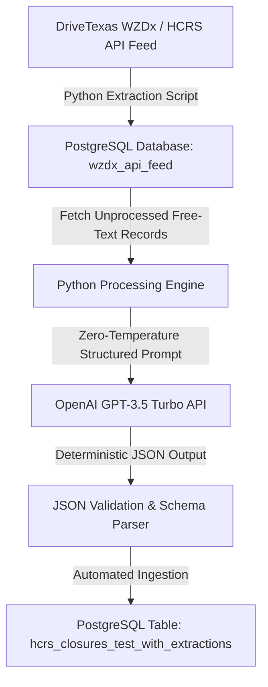

## Project Overview

The Texas Department of Transportation's (TxDOT) Work Zone Data Exchange (**WZDx**) and Highway Condition Reporting System (**HCRS**) API feeds provide real-time status updates on statewide road closures and active construction zones. 

However, critical operational details—such as whether a closure affects frontage roads or mainlines, exact lane counts, direction of travel, and recurring nighttime schedules—were buried inside free-text description fields (`core_details_description`) manually typed by field personnel without standardized formatting.

To enable automated traffic analysis and delay modeling, I engineered an automated **LLM Natural Language Parsing Engine** using Python, OpenAI's GPT-3.5 Turbo, and PostgreSQL to extract standardized, structured JSON attributes from unstructured raw text descriptions.

---

## The Challenge: Unstructured Field Text

Traditional regular expressions and keyword matching failed to parse field entries reliably due to varied syntax, shorthand, and localized jargon:

> **Raw WZDx Input Example:**  
> `"- Entrance Ramp closed. - Nighttime closure only. The entrance ramp to the westbound SH 121/138 TEXpress Lanes from the westbound SH 121/183 general purpose lanes at Industrial Blvd. (FM 157) will be closed. Traffic will be maintained using the general purpose lanes."`

Key challenges included:
1. **No Standardized Syntax:** Differing acronyms, abbreviations, and informal punctuation.
2. **Complex Spatial & Temporal Attributes:** Disentangling direction, road classification (mainline vs. frontage), affected lanes, and time windows in a single pass.
3. **Database Integration:** Maintaining real-time ingestion from the TxDOT API feeds into PostgreSQL without producing duplicate entries or hitting OpenAI rate limits.

---

## Technical Architecture & Prompt Engineering



### 1. Deterministic Prompt Engineering & JSON Schema Enforcement
Designed zero-temperature system prompts instructing the model to parse 5 key operational attributes into a strict, validated JSON structure:
- **`lane_closure`**: Binary classification (`"Yes"` / `"No"`).
- **`lanes_affected`**: Specific lanes and counts (e.g., `"Entrance Ramp"`, `"Left 2 Lanes"`).
- **`road_type`**: Classification into `"Mainline"` vs `"Frontage road"`.
- **`direction`**: Affected cardinal direction (`"Northbound"`, `"Southbound"`, `"Eastbound"`, `"Westbound"`).
- **`closure_frequency`**: Temporal recurrence (`"Nighttime only"`, `"Recurring nightly"`, or `"One-time event"`).

### 2. High-Throughput Database Pipeline & Rate-Limit Handling
- **Database Schema Automation**: Automatically created relational PostgreSQL tables (`hcrs_closures_test_with_extractions`) with unique index constraints on `core_details_description` to eliminate redundant API calls.
- **Resilient Retry Logic**: Integrated automated exponential backoff and error handling for OpenAI API rate limits and connection timeouts.
- **Relational Data Mapping**: Joined extracted LLM metadata back to spatial roadway bounding boxes for downstream traffic delay visualization.

---

## Sample Execution & Output Mapping

### Raw Input:
```text
- Entrance Ramp closed.
- Nighttime closure only.
The entrance ramp to the westbound SH 121/138 TEXpress Lanes from the westbound SH 121/183 general purpose lanes at Industrial Blvd. (FM 157) will be closed. Traffic will be maintained using the general purpose lanes.
```

### Structured Output (Extracted via Engine):
```json
{
  "lane_closure": "Yes",
  "lanes_affected": "Entrance ramp",
  "road_type": "Mainline",
  "direction": "Westbound",
  "closure_frequency": "Nighttime closure only"
}
```

---

## Key Accomplishments & Impact

- **Automated Data Structuring:** Successfully converted thousands of unstandardized, free-text TxDOT work zone descriptions into structured PostgreSQL relational records.
- **Enabled Downstream Spatial Analytics:** Allowed TxDOT traffic engineers to filter and evaluate construction delays by road type, direction, and time-of-day.
- **Cost-Effective Pipeline:** Optimized token windowing and prompt length to process large historical datasets at negligible API cost.
- **Zero-Maintenance Relational Schema:** Built an automated database synchronization script that processes new API records in real time without manual oversight.
